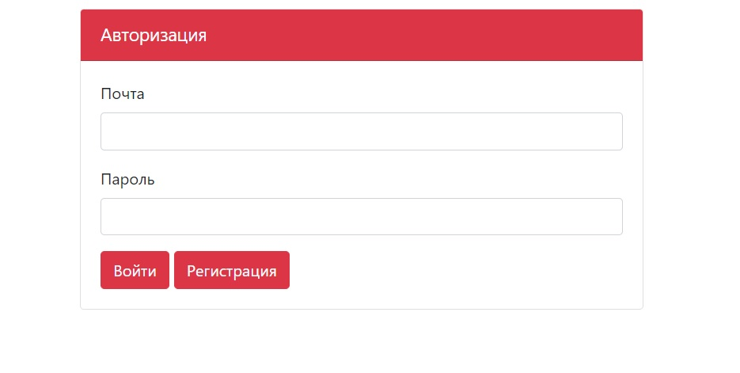
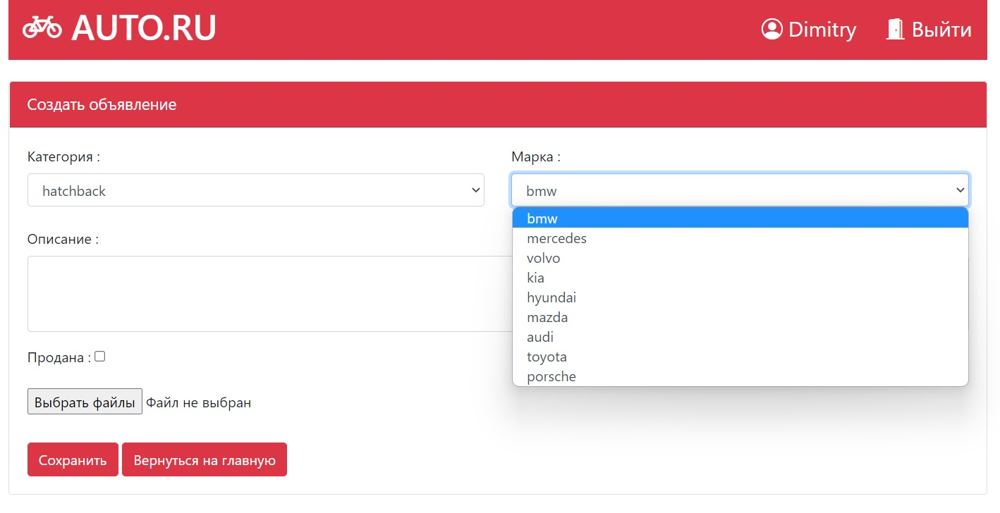
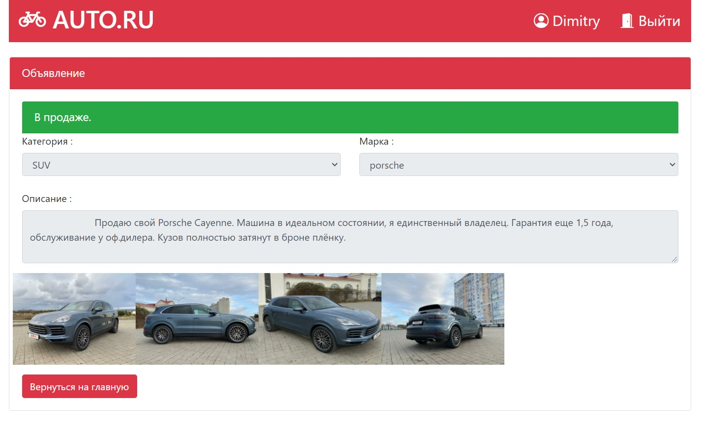
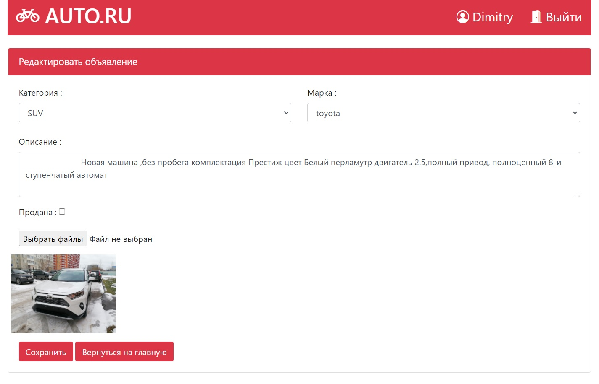

# job4j_carshop

#### Сервис объявлений по продаже автомобилей
- Регистрация пользователя
- Форма входа в программу с проверкой пользователя
- Добавление объявлений доступно только зарегистрированным пользователям, остальные могут только просматривать
- Возможность прикрепить несколько фотографий
- Хранение фотографий на сервере, генерация уникальных имён
- Изменять объявления может только автор

#### Используемые технологии  
- Hibernate framework
- HQL
- JAVA servlets/JSTL
- Bootstrap
- JS/jQuery
- Travis CI

#### Интерфейс
- Авторизация:

- Регистрация:

- Главная страница авторизированного пользователя:

- Форма создания объявления:

- Страница с объявлением другого пользователя:

- Редактирование ранее созданного объявления:
